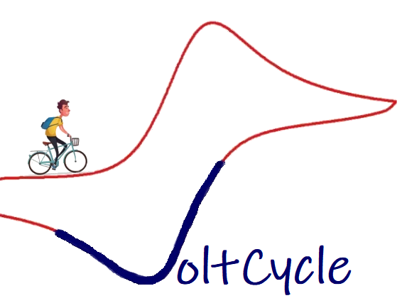

# Voltcycle   
[](https://opensource.org/licenses/MIT)
[]
(https://travis-ci.org/sabiharustam/voltcycle)

[![Scrutinizer Code Quality]

(https://scrutinizer-ci.com/g/sabiharustam/voltcycle/badges/quality-score.png?b=master]

(https://scrutinizer-ci.com/g/sabiharustam/voltcylce/?branch=master)

## Package for Cyclic Voltammetry Visualization and Analysis
This package can be used to take cyclic voltammetry data,
clean and plot the data, and find and fit peaks to obtain peak locations.
It also creates baseline and based on peak location,
and calculates the peak current and voltage.
Finally use those descriptors to classify a battery material as either
electrochemically reversable or not, also to determine if it is an
anolyte or catholyte. Additionally, there is a GUI based visualization
app that can be used to upload the users data,
choose the plotting style and color. This package could be expanded
upon to be able to handle different formats of data. For a more 
specific overview of the project, please see the usecase under docs. 

### Software Dependencies and Additional Installation Info 
- Python3 
- For python packages see requirements.txt
- matplotlib is another required package but cannot be included in the requirements.txt file 
    because there are issues with pip installion on Mac OS X. Instead, matplotlib should be 
    conda installed separately from the installation of the voltcycle package. version 3.0.3
    will work with this package.  
- hdhh

## Organization of the project
``` 
Rawdata/
Voltcycle/ 
    Trialcodes/
        testdata/
        README.md
        __init__.py
        cv_trial.py
        file_read.py
				test.txt
				trial.ipynb
    __init__.py
    FINAL.py 
    PLOT.py
    GUI.py 
    README.md
docs/ 
    Technology_review.pptx
    over_view.md
    usecases.md
LICENSE
README.md
requirements.txt(FOR DEPENDENCIES)
setup.py(if we have final installable)
```


## User Interface


## Howto
The example usage of the functions are shown in example folder ipython notebook. User can use functions in ipython notebook 
to analyze their data without DASH interface. User can also obtain high quality images using example.ipynb. Here is an 
example image:

After install the requirements, user can use dash interface for more interactive data visualization. Users can upload raw 
cyclc voltammetry data, the app then will plot the cv plots with peaks and baseline included. Under the plots all the 
calculated values and classification of electrolyte are shown in table format.
User can download the plots using right click save figure.

## Workflow of the Project


See our poster for the quarter summary 
[here](https://github.com/sabiharustam/voltcycle/blob/master/images/Final%20Poster.pdf)

This package is still under development. If you have any questions please email authors. 

### References for images:
- https://www.fotolia.com/id/209712729
- https://www.youtube.com/watch?v=3l1hJzUqi2A 
